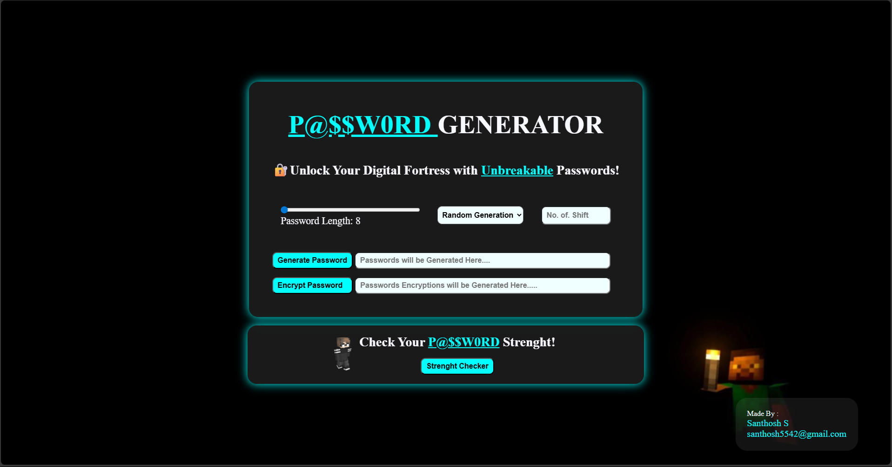
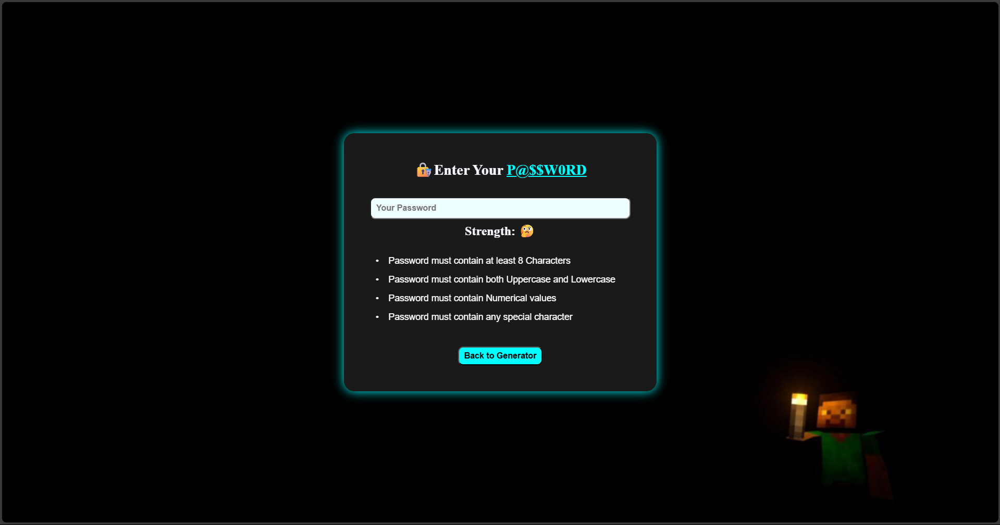

# Password Generator & Strength Checker Webpage

## Overview
This project is a password utility webpage that allows users to generate strong, random passwords, check their strength, and encrypt them using various encryption algorithms. The webpage is built using HTML, CSS, and JavaScript.

## Features
 
* 🔐 **Generate random passwords** with customizable length.
* ✅ **Password strength checker** with real-time suggestions and visual indicators.
* ✨ **Custom strength meter** with live feedback and password tips.
* ⚔️ **Encrypt passwords** using one of the following algorithms:

  * AES (Advanced Encryption Standard)
  * DES (Data Encryption Standard)
  * ROT13 (Rotate by 13 places)
  * Caesar Cipher (Shifts to next letter) 

## Technologies Used

* HTML: For structuring the webpage.  
* CSS: For styling the webpage.  
* JavaScript: For implementing the password generation and encryption functionalities.  

## How to Use

### 🛠 Generator & Encryption Page
* **Open the Webpage**: Open the `index.html` file in your web browser.  
* **Set Password Length**: Use the slider to set the desired length of the password.  
* **Generate Password**: Click the “Generate Password” button to create a random password.  
* **Select Encryption Algorithm**: Choose an encryption algorithm from the dropdown menu.  
* **Encrypt Password**: Click the “Encrypt Password” button to encrypt the generated password.  
* **View Encrypted Password**: The encrypted password will be displayed in the designated field.  

### 💪 Strength Checker Page
* **Navigate to Checker:** Use the "Strength Checker" button or go to `checker.html`.
* **Enter Password:** Start typing in the input field.
* **Check Suggestions:** Suggestions will update in real-time (length, uppercase, numbers, special chars).
* **Visual Feedback:** Colored indicators and animated text show the password’s strength level.

## Encryption Algorithms  

### AES (Advanced Encryption Standard)
   AES is a symmetric encryption algorithm widely used across the globe. It provides a high level of security and is used in various applications.  

### DES (Data Encryption Standard)
   DES is an older symmetric encryption algorithm that was widely used in the past. It has been largely replaced by AES due to its shorter key length and lower security.  

### ROT13 (Rotate by 13 places)
   ROT13 is a simple substitution cipher that replaces each letter with the letter 13 places after it in the alphabet. It is not suitable for serious encryption but is often used for obfuscating text.  

### Caesar Cipher
   The Caesar Cipher is a substitution cipher where each letter in the plaintext is shifted a certain number of places down the alphabet. It is one of the simplest and most widely known encryption techniques.